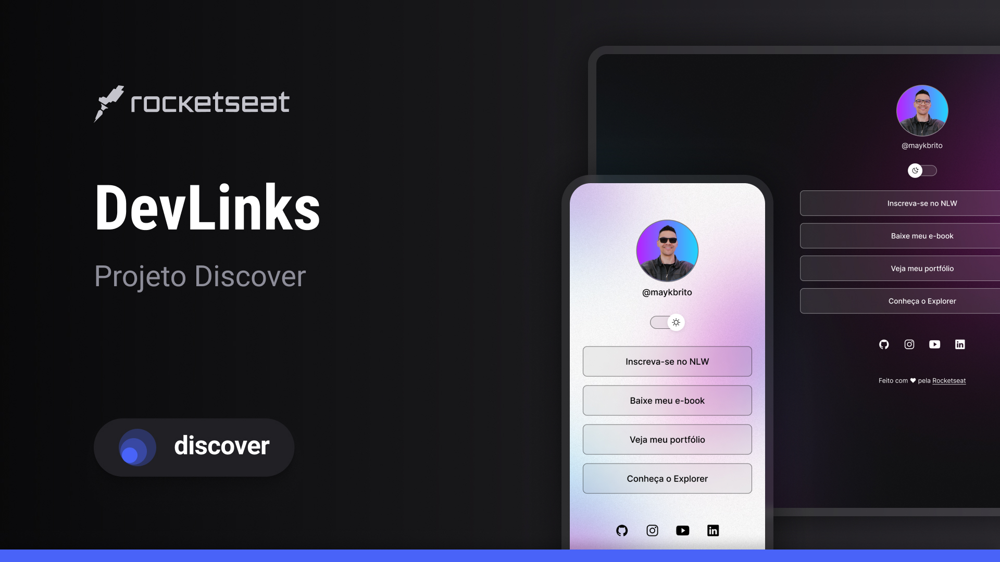

<h1 align="center"> Portifólio #DevLinks </h1>

Minha jornada profissional e presença nas redes sociais.

  <a href="#-tecnologias">Tecnologias</a>&nbsp;&nbsp;&nbsp;|&nbsp;&nbsp;&nbsp;
  <a href="#-projeto">Projeto</a>&nbsp;&nbsp;&nbsp;|&nbsp;&nbsp;&nbsp;
  <a href="#-layout">Layout</a>&nbsp;&nbsp;&nbsp;|&nbsp;&nbsp;&nbsp;
  <a href="#memo-licença">Licença</a>

  

 

  

## 🚀 Tecnologias

Esse projeto foi desenvolvido com as seguintes tecnologias:

- HTML e CSS
- JavaScript
- Git e Github
- Figma

## 💻 Projeto

Aplicação prática de conceitos de front-end desenvolvida durante meu aprendizado na plataforma Rocketseat

## 🔖 Layout

Você pode visualizar o layout do projeto através desse link:
https://www.figma.com/design/YkeMPZfVy6B8MlVtI46c9J/DevLinks-%E2%80%A2-Projeto-Discover--Community-?node-id=1437-256&t=5VJv6uw9TdSAhrMP-0

## 🔖 Licença

Esse projeto está sob a licença MIT..
